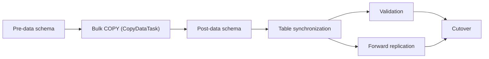

# Resharding — Implementation

This document describes how the resharding pipeline works at the code level. For the user-facing
prerequisites, step-by-step guide, and cutover configuration see
[Resharding Postgres](https://docs.pgdog.dev/features/sharding/resharding/) and the companion
blog post [Shard Postgres with one command](https://pgdog.dev/blog/shard-postgres-with-one-command).
For sharding routing internals see [SHARDING.md](./SHARDING.md).
For the replication engine internals see [REPLICATION.md](./REPLICATION.md).

---

## Entry point — `RESHARD` command

```sql
RESHARD <source> <destination> <publication>;
```

Issued against the admin database. Parsed in [`pgdog/src/admin/reshard.rs`](../pgdog/src/admin/reshard.rs), which calls
`Orchestrator::new(source, destination, publication, slot_name)` and then starts a `ReshardTask`
([`api/resharding.rs`](../pgdog/src/api/resharding.rs)) in the background. The command replies with
the task id. `SHOW TASKS` reports the progress.

> **Multi-node deployments:** Traffic cutover via `RESHARD` is supported on single-node PgDog only.
> The [Enterprise Edition control plane](https://docs.pgdog.dev/enterprise_edition/control_plane/)
> is required for coordinated cutover across multiple PgDog containers.

## Manual copy and replication

`COPY_DATA` runs the migration without automatic cutover:

```sql
COPY_DATA source destination publication migration_slot;
SHOW TASKS;
```

It runs pre-data schema, bulk copying, post-data schema, table synchronization, and forward replication.
Do not start another replication task while this task runs.

`data-sync --skip-schema-sync` skips pre-data and post-data schema sync.
The task still synchronizes tables before forward replication.
The operator can then run `schema-sync --phase post` while replication runs.
This manual post-data run ignores statement errors by default, as does admin `SCHEMA_SYNC post`.
Do not run it again after a post-data restore while destination writes are active.
A second run drops and rebuilds the existing indexes.

---

## Orchestrator

`Orchestrator` in [`pgdog/src/backend/replication/logical/orchestrator.rs`](../pgdog/src/backend/replication/logical/orchestrator.rs) owns:
- `source: Cluster` / `destination: Cluster` — connection handles to the two database clusters
- `publisher: Arc<Mutex<Publisher>>` — manages replication slots, table list, and lag tracking
- `replication_slot: String` — auto-generated as `__pgdog_repl_<random19>` unless overridden

`ReshardTask::run` drives the migration stages below in sequence:



---

## Step 1 — Schema dump

`Orchestrator::load_schema()` creates a `PgDump` ([`pgdog/src/backend/schema/sync/pg_dump.rs`](../pgdog/src/backend/schema/sync/pg_dump.rs))
with the source cluster and publication name, calls `pg_dump.dump().await`, and stores the
`PgDumpOutput` on the orchestrator. This output carries pre-data (tables, types, extensions,
primary key constraints), secondary index DDL, validation operations, and sequences — split
into `SyncState` phases so they can be applied in the right order later.

---

## Step 2 — Pre-data schema sync

`schema_sync_pre()` restores `SyncState::PreData` from the dump to the destination cluster, then:
1. Calls `reload_from_existing()` to refresh PgDog's in-memory schema cache so subsequent routing
   decisions reflect the new destination schema.
2. Re-fetches `source` and `destination` clusters from `databases()` (addresses may have changed
   after the reload).
3. If the destination has `RewriteMode::RewriteOmni`, installs the sharded sequence schema via
   `Schema::install()`.

Each source table needs a supported replica identity.
PgDog accepts primary keys, suitable unique indexes, or `REPLICA IDENTITY FULL`.
A `FULL` table without sharding also needs a unique index on each destination.
Post-data schema sync creates these destination indexes before synchronization.

---

## Step 3 — Data sync

`ReshardTask` runs three child tasks in order: `CopyDataTask`, post-data schema sync, and `SynchronizeTablesTask`.
It reports `SyncingData`, `FinalizingSchema`, and `SynchronizingTables`.
`--skip-schema-sync` skips post-data schema sync. `--replicate-only` skips the copy and table synchronization.
`--sync-only` runs all three child tasks and stops before replication.

### Bulk copy

`CopyDataTask` creates a worker pool for each source shard from its configured source replicas.
Each pool limits concurrent copies to `dest.resharding_parallel_copies()`.
Each `TableDataSyncTask` uses a separate snapshot on its selected source replica.
The copy task collects each table's result before it returns.

> **Replica isolation:** replicas tagged `resharding_only = true` in `pgdog.toml` accept copy work but not normal application traffic.
> Each worker pool limits concurrent copies to protect the source replicas and destination shards.

> **WAL disk space:** each per-table `ReplicationSlot` created during the copy prevents PostgreSQL
> from recycling WAL on the source until the slot is drained. Estimate WAL write rate × copy
> duration and provision that headroom before starting. An orphaned slot from a failed reshard
> accumulates WAL indefinitely — drop it before retrying (see "When things go wrong" below).

### Per-table copy flow ([`Table::data_sync()`](../pgdog/src/backend/replication/logical/publisher/table.rs))

Each task performs this sequence against its assigned source replica:

1. Creates a `CopySubscriber` — opens connections to all destination shards.
2. Creates a `ReplicationSlot::data_sync()` — opens a streaming replication connection to the
   source replica.
3. `slot.create_slot()` — creates a **temporary** logical replication slot, returning the current
   LSN. This pins the WAL position atomically inside the same transaction as the copy.
4. `copy.start()` — issues `COPY table TO STDOUT (FORMAT BINARY)` on the source.
5. Streams each row through `copy_sub.copy_data(row)` — the `CopySubscriber` runs the same
   `ContextBuilder` → `Context::apply()` sharding pipeline used for live queries, and forwards
   each row to the correct destination shard(s).
6. `copy_sub.copy_done()` — sends `CopyDone` to each destination shard, flushes, disconnects.
7. `slot.start_replication()` + drain loop — replays any WAL accumulated since slot creation,
   then sends a status update confirming the slot position. The slot is `TEMPORARY` and is
   automatically dropped when the replication connection closes.
8. `COMMIT` closes the transaction on the source replica.

Each table records its copy LSN.
`CopyDataTask` stores these results in the shared migration state.
Each table copy uses its own snapshot, so the copied tables are not consistent with each other yet.

### Post-data schema sync

`ReshardTask` runs `SchemaSyncTask` with `SyncState::PostData` after `CopyDataTask` finishes.
The schema task shares the dump with the other migration phases.
Post-data creates secondary indexes, unique and exclusion constraints, and index partition attachments.
It also restores each table's `REPLICA IDENTITY` and adds foreign keys in dump order.
Eligible foreign keys are added as `NOT VALID` to avoid a blocking data scan.
Schema errors stop the migration before table synchronization starts.
Creating indexes after `COPY` avoids index maintenance during copying.

### Table synchronization

After post-data schema sync, `SynchronizeTablesTask` starts temporary forward replication through the permanent migration slots.
Each source shard must reach the largest copy LSN recorded for its tables.
The task stops and drains temporary replication before it returns.
The destination replication connections use `session_replication_role = replica`.
After this step the copied tables are consistent, so foreign key validation can run.
Table synchronization streams even with `data-sync --sync-only`.
So every copy needs a supported replica identity on each source table.

---

## Step 4 — Validation and forward replication

`SyncState::PostDataValidation` runs `VALIDATE CONSTRAINT` for each foreign key that post-data restored as `NOT VALID`.
Validation is strict. A violation fails the validation task and stops the migration.
The `[resharding] post_data_validation` setting selects when validation runs.
`ReplicationTask` reads this setting once, when it starts.

| Value | When validation runs |
|---|---|
| `during_replication` (default) | Together with forward replication. Cutover cannot start before validation succeeds. |
| `before_cutover` | After forward replication catches up, while source traffic is paused. Traffic stays paused until validation finishes. |
| `after_cutover` | On the new source, together with reverse replication after the first cutover only. A failure marks the validation task as failed, but reverse replication continues and a rollback stays possible. A rollback does not wait for validation. |
| `off` | Never. The foreign keys stay `NOT VALID`. |

Validation never runs for `data-sync --skip-schema-sync`, `--replicate-only`, or `--sync-only`.
Foreign keys that post-data restored in `--replicate-only` or `--sync-only` runs stay `NOT VALID`.

## Step 5 — Cutover

`ReplicationTask` waits for its cutover signal or automatic policy.
With `during_replication`, it also waits until validation succeeds.
It cuts over, flips direction, and then streams in reverse so a rollback stays possible.

### Publisher and StreamSubscriber

See [REPLICATION.md](./REPLICATION.md) for the full engine description — WAL message flow,
module responsibilities, and unchanged-TOAST handling.

Two behaviours are specific to the resharding context:

- **LSN watermark**: each table starts replay from its recorded copy LSN. Messages at or below
  that LSN are skipped because the row already exists on the destination.
- **Omnisharded tables** (`statements.omni = true`): upsert is broadcast to all shards
  simultaneously rather than routed to a single shard.
- **Table ownership** ([`tables_sync()`](../pgdog/src/backend/replication/logical/tables_sync.rs)):
  a table that is *sharded on the source* is copied and replayed from every source shard.
  A table that is *omnisharded on the source* is copied and replayed from one source shard
  only, chosen by publication order, because every source shard holds the same rows.
- **Destination row contention**: a table that is sharded on the source and omnisharded on
  the destination is replayed by every subscriber, and every subscriber writes to every
  destination shard. Two subscribers therefore write the same destination row whenever one
  key reaches two source shards, for example after a sharding-key update. Two subscribers
  can then lock the same rows on two destinations in opposite order. No Postgres instance
  sees the whole cycle, so no instance reports a deadlock. Set `lock_timeout` on the
  destination user so a blocked apply is cancelled and retried by `Publisher::replicate()`.
---

### Cutover phases

**Phase 1 — `CutoverPolicy::wait_for_stop_threshold()`**: polls lag every 1 second. It returns
when `lag ≤ cutover_traffic_stop_threshold`. `Migration::prepare_cutover` then:
1. Calls `MaintenanceMode::stop_traffic()`, which calls `maintenance_mode::start(None)` — new
   queries queue behind a barrier.
2. Calls `cancel_all(source_db)` — cancels any queries already in flight.

**Phase 2 — `CutoverPolicy::wait_for_catchup()`**: polls at 50 ms intervals. Three independent
triggers can fire cutover (whichever comes first):

| Trigger | Config key | Action |
|---|---|---|
| `lag ≤ threshold` | `cutover_replication_lag_threshold` | `CutoverReason::Lag` → proceed |
| elapsed ≥ timeout | `cutover_timeout` | `CutoverReason::Timeout` → proceed or abort (see `cutover_timeout_action`) |
| no transaction applied for N ms | `cutover_last_transaction_delay` | `CutoverReason::LastTransaction` → proceed |

The `LastTransaction` trigger needs a measured transaction. A stream that has applied nothing
reports no value, so the trigger stays silent and only the timeout can fire.

The `Lag` trigger uses the last lag value of each stream. Each stream measures lag once per second,
so the value can be older than the traffic stop. The drain below still applies the source WAL written
before the stop, so an older value can only start the drain earlier.

**Phase 3 — drain and stop**: after a trigger fires, `replicate_until_cutover()` stops the cluster task
with the cutover reason. The cluster task then calls `ReplicationStream::stop(true)` on every stream.
Every other stop calls `stop(false)`: table synchronization, `STOP_TASK`, and a failed sibling stream.
A later `stop(false)` replaces a drain, for example when the task is cancelled.

A stream stopped with drain does these steps:

1. It reads `pg_current_wal_lsn()` on the source shard at once.
   Traffic is paused, so this LSN covers every committed change.
2. It keeps reading until its committed LSN reaches that position. The committed LSN moves only
   after every destination shard flushed a commit. Keepalive messages move it past WAL that has
   no published changes when no transaction is open. A connection error is retried as usual.
   A retry rolls back the open transactions, so the stream reads them again before it stops.

The triggers above therefore only decide when the drain starts. A drain never skips committed changes.

Then every stop works in the same way. The stream stops reading after the open transaction,
so new data cannot keep it busy. It waits until every destination shard flushed the applied changes,
sends a status update, and sends `CopyDone`. The WAL that is not read stays in the slot.

If a draining stream does not reach its position in `DRAIN_TIMEOUT` (120 s), it stops in the same way
and returns `Error::CatchUpTimeout`. `replicate_until_cutover()` then resumes traffic, and the cutover is aborted.
It raises the LSN of every table to the applied LSN, and starts a new cluster task from the same slots.
With automatic cutover, the new task starts Phase 1 again.
With a manual cutover, it waits for a new `CUTOVER` command.

The budget is `ReplicationClusterTask::drain_timeout()` (300 s) for the cluster.
The streams get `stream_drain_timeout()` (120 s), plus `DRAIN_TIMEOUT` for a drain.
A stream that does not stop in time is aborted, and its `SlotGuard` drops the replication slot
on a detached task. A failed stop returns `Error::DrainTimeout`.

**Point of no return** — `Migration::cutover()` runs these steps in order:

1. `Publisher::create_slots(destination)` — creates the reverse replication slots.
2. `cutover(source_db, dest_db)` in [`pgdog/src/backend/databases.rs`](../pgdog/src/backend/databases.rs) —
   atomically swaps the two clusters' logical identity in the routing table (and config refs via
   `Config::cutover`/`Users::cutover`); no data moves. Persisted to disk when
   `cutover_save_config = true`.
3. `Orchestrator::refresh()` — re-fetches both clusters from `databases()`.
4. `MaintenanceMode::resume_traffic()` — releases the barrier; queued and new queries flow to the
   new cluster.

`Migration::run` then flips direction and streams in reverse, from the new cluster to the old one.
The reverse phase runs in the same task, not in a separate one. A `STOP_TASK` during the reverse
phase ends the rollback window, and the task reports the migration as finished.

With the default `during_replication` setting, `SyncState::PostDataValidation` starts beside forward
replication after table synchronization.
It validates each deferred foreign key with `ALTER TABLE ... VALIDATE CONSTRAINT`.
A validation failure stops replication before cutover. Successful validation releases the
cutover gate. See Step 4 for the other settings.

---

## Error handling and fault tolerance

### Pre-cutover failures — plain propagation

The pre-data, copy, post-data, and table synchronization stages stop the migration if they fail.
The effect of a validation failure depends on `[resharding] post_data_validation`:

- `during_replication` (default): the failure stops the forward stream before maintenance mode. Source traffic does not change.
- `before_cutover`: validation runs while source traffic is paused. The failure stops the migration before cutover, and traffic resumes on the original source.
- `after_cutover`: the failure marks the validation task as failed. Traffic stays on the new cluster, and reverse replication continues.
- `off`: validation does not run.

### Schema DDL — intentional error tolerance

The pre-data and cutover stages use `ignore_errors = true`.
`ReshardTask` runs post-data schema sync after a copy with `ignore_errors = false`.
A required index failure therefore stops the migration before table synchronization.
Two kinds of post-data statement do not stop it. They record a failure in the shard status:

- `DROP INDEX IF EXISTS` before each index. It fails when a foreign key depends on an existing index.
  The next `CREATE INDEX IF NOT EXISTS` then keeps the existing index.
- A foreign key on a partitioned table, when the destination runs PostgreSQL 17 or older.
  These versions do not accept `NOT VALID` for it, so the key is validated at once.
  Table copies use different snapshots, so the check can fail before synchronization repairs the rows.
  A failed key is missing on the destination. Add it by hand after the migration.

Replicate-only migrations retain error tolerance for their separate post-data restore.
Manual CLI and admin post-data syncs also ignore statement errors by default.
The validation stage is also strict.
A foreign key violation marks the validation task as failed.

### Data sync — abort propagation and cooperative cancellation

[`Table::data_sync()`](../pgdog/src/backend/replication/logical/publisher/table.rs) runs the COPY row loop under a `tokio::select!` that races two futures:
the next row from the source, and `AbortSignal::aborted()`. `AbortSignal` wraps the closed-state
of the `UnboundedSender` shared with `ParallelSyncManager` — it resolves when the channel is
dropped. If the channel closes mid-copy (e.g. because another table's task failed and the manager
is torn down), the loop returns `Error::CopyAborted`. The task does not need to be explicitly
cancelled.

[`ParallelSync::run()`](../pgdog/src/backend/replication/logical/publisher/parallel_sync.rs) checks `tx.is_closed()` before acquiring the semaphore permit. A task that
wakes after the channel is already closed returns `Error::DataSyncAborted` immediately without
starting a copy.

Error propagation from the manager: `run()` drives completion via `rx.recv()`. The first `Err`
returned by any task surfaces via `table?` and aborts the manager's loop. Remaining tasks run to
completion or abort via their own `AbortSignal`, but their results are ignored once the channel
is dropped.

On a failed or aborted migration, `ReshardTask::run` ([`api/resharding.rs`](../pgdog/src/api/resharding.rs))
obtains a guard via `Orchestrator::publication_guard()` and calls `PublicationGuard::cleanup()`, which
locks the publisher and has `Publisher::cleanup()` drop the permanent WAL slot via
`DROP_REPLICATION_SLOT "name" WAIT`. On success the slot is kept so reverse replication can roll
back. If the process crashes before this runs, the slot survives and keeps accumulating WAL on the
source — drop it manually before retrying.

### Temporary replication slots

Per-table slots created in [`Table::data_sync()`](../pgdog/src/backend/replication/logical/publisher/table.rs) are `TEMPORARY` — PostgreSQL drops them
automatically when the replication connection closes, including on error or panic. A failed copy
task leaves no orphaned per-table slot.

### `MaintenanceMode` — guaranteed traffic resumption

`Migration` owns a `MaintenanceMode` guard ([`api/replication.rs`](../pgdog/src/api/replication.rs)).
`stop_traffic()` calls `maintenance_mode::start(None)` and records that it did.
`resume_traffic()` calls `maintenance_mode::stop(None)` only when the barrier is on, so every
caller can call it safely. Three paths release the barrier:

1. `Migration::cutover()` releases it after the swap.
2. `prepare_cutover()` releases it when the catch-up wait fails.
3. `replicate_until_cutover()` releases it when the phase ends with an error, including a
   `STOP_TASK`, so the barrier does not survive the drain.

`ReplicationTask::run` calls `resume_traffic()` again after `Migration::run` returns. The `Drop`
impl is the last backstop, for a panic or for an aborted task future.

### AbortTimeout

When `cutover_timeout_action = "abort"` and the timeout fires in `wait_for_catchup()`, the policy
returns `Err(Error::AbortTimeout)`. `prepare_cutover()` then resumes traffic. The cutover was
never attempted, so no data moved and no swap occurred.

### Idempotency guarantees

Several mechanisms make it safe to replay data across a restart:

| Mechanism | Where | Effect |
|---|---|---|
| Temporary replication slots | `Table::data_sync()` | Auto-dropped on connection close; no orphaned per-table slots |
| `ignore_errors = true` | Pre-data and cutover schema sync | Pre-existing DDL does not abort the run |
| Strict post-data restore | `ReshardTask`, after bulk copying | Stops table synchronization if required schema fails |
| FK validation | Set by `[resharding] post_data_validation` (default: beside forward replication) | Validates deferred foreign keys; skipped for `off`, `--skip-schema-sync`, `--replicate-only`, and `--sync-only` |
| LSN watermark guard | Copy synchronization and normal replication | Skips rows already included in each table copy |
| Upsert on INSERT messages | `Table::insert(upsert=true)` | `ON CONFLICT (pk) DO UPDATE SET` prevents duplicates on WAL re-delivery |
| PK validation | `Table::valid()` | Fails before any data moves; restart is clean |
